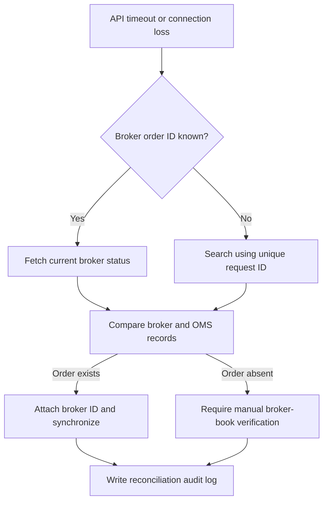

An absent search result is not treated as proof that submission failed. Broker
history may be incomplete or session-scoped, so an uncertain `SUBMITTED` child
is never automatically placed again.

Basket child recovery is state-specific:

- `PENDING` with a failed execution job can be requeued safely because broker
  submission was never claimed.
- `SUBMITTED` without a broker order ID must be recovered by the original child
  order ID before synchronization; it is never sent again blindly.
- `REJECTED` is terminal. A new single-client basket for only the unfilled
  quantity, with a new order identity, is created and linked to the rejected
  source. A deterministic replacement basket ID uses the existing primary key
  to permit only one replacement basket per rejected child.
